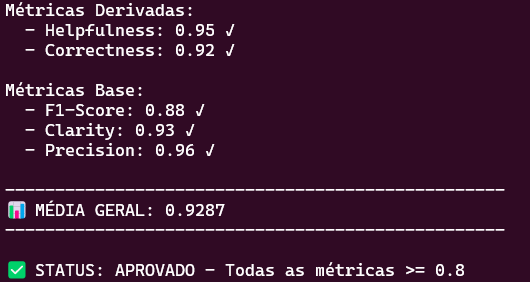
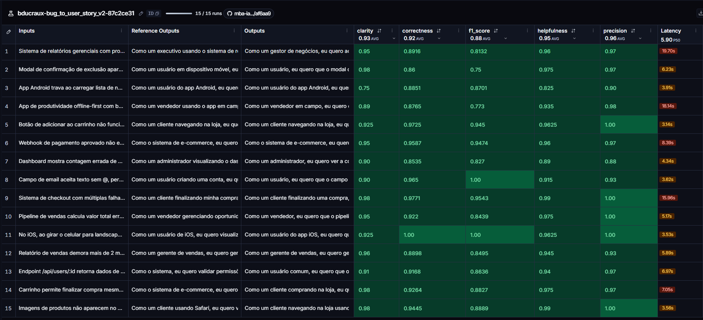

# Pull, Otimização e Avaliação de Prompts com LangChain e LangSmith

Projeto do desafio do MBA em Engenharia de Software com IA (Full Cycle): puxar do LangSmith Prompt Hub um prompt de baixa qualidade que converte relatos de bugs em User Stories, otimizá-lo com técnicas de Prompt Engineering, publicar a versão otimizada e avaliá-la com 5 métricas (Helpfulness, Correctness, F1-Score, Clarity e Precision), todas ≥ 0.8.

| Item | Onde |
| --- | --- |
| Prompt original (v1) | [`prompts/bug_to_user_story_v1.yml`](prompts/bug_to_user_story_v1.yml) — puxado de `leonanluppi/bug_to_user_story_v1` |
| Prompt otimizado (v2) | [`prompts/bug_to_user_story_v2.yml`](prompts/bug_to_user_story_v2.yml) — público em [`bducraux/bug_to_user_story_v2`](https://smith.langchain.com/hub/bducraux/bug_to_user_story_v2) |
| Dataset de avaliação + experimentos (público) | https://smith.langchain.com/public/5ea76a87-93dc-4b10-bd63-65b7e2d7c429/d |
| Resultado final | **APROVADO** — todas as métricas ≥ 0.88, média 0.929 |

---

## A) Técnicas Aplicadas (Fase 2)

O v1 tinha os problemas típicos de um prompt fraco: persona genérica ("um assistente"), o `{bug_report}` duplicado no system e no user prompt, nenhuma definição de formato, nenhum exemplo e nenhuma regra. O resultado era uma user story correta, mas incompleta frente ao padrão esperado (F1 = 0.74).

O v2 combina quatro técnicas, listadas em `techniques_applied` no YAML:

### 1. Role Prompting

**Por quê:** a tarefa exige julgamento de produto (quem é o usuário afetado, qual o valor de negócio) e repertório técnico (o que é um critério técnico plausível). Uma persona específica ativa esse vocabulário e o tom de documentação ágil.

**Como apliquei:**

```text
Você é um Product Manager sênior com 10 anos de experiência em times ágeis e forte base
técnica em desenvolvimento web, mobile e backend. Sua especialidade é transformar relatos
de bugs em User Stories claras, acionáveis e fiéis ao relato, prontas para o backlog.
```

### 2. Few-shot Learning

**Por quê:** F1, Correctness e Precision comparam a resposta com uma referência. A forma mais eficaz de alinhar estrutura (seções, ordem, padrão Dado/Quando/Então/E) é mostrar exemplos completos. Usei **3 exemplos originais**, um por nível de complexidade (simples, médio e complexo), escritos do zero para não copiar o gabarito do dataset.

**Como apliquei** (trecho do exemplo simples):

```text
### Exemplo 1 (SIMPLES)
Relato de bug:
Link "Esqueci minha senha" não envia o email de recuperação para contas criadas pelo Google.

User Story:
Como um usuário que criou a conta pelo Google, eu quero receber o email de recuperação ao
clicar em "Esqueci minha senha", para que eu possa redefinir minha senha e voltar a acessar minha conta.

Critérios de Aceitação:
- Dado que minha conta foi criada pelo login com Google
- Quando clico em "Esqueci minha senha" e informo meu email
- Então devo receber o email de recuperação de senha
- E o link do email deve permitir definir uma nova senha
- E devo ver uma mensagem confirmando que o email foi enviado
- E o link de recuperação deve poder ser usado apenas uma vez
```

### 3. Chain of Thought (interno)

**Por quê:** converter um bug em story exige decisões encadeadas (papel → objetivo → benefício → fatos a cobrir → comportamentos esperados → nível de complexidade). Pedir esse raciocínio explicitamente melhora a escolha do papel e a cobertura. O raciocínio fica **interno**: expor a análise na saída derrubaria Clarity e Precision.

**Como apliquei:**

```text
## Processo de raciocínio (interno — NÃO escreva na resposta)
Antes de escrever, pense passo a passo em silêncio:
1. Quem é o papel afetado? Escolha o mais específico, seguindo estas pistas: ...
2. O que esse papel quer conseguir fazer (comportamento correto, escrito de forma positiva)?
3. Qual o benefício real para ele ou para o negócio?
4. Quais fatos concretos o relato traz (números, endpoints, mensagens de erro, ...)?
5. Que comportamentos complementares um PM experiente esperaria ...?
6. Qual o nível de complexidade (SIMPLES, MÉDIO ou COMPLEXO)? Escolha o esqueleto correspondente.
Entregue SOMENTE a User Story final, sem mostrar esta análise.
```

### 4. Skeleton of Thought

**Por quê:** o dataset tem 5 bugs simples, 7 médios e 3 complexos, e as referências têm tamanhos muito diferentes (de ~400 a ~5.700 caracteres). Um formato único deixaria bugs simples verbosos (Clarity cai) ou bugs complexos rasos (F1 cai). Defini um **esqueleto de saída por nível**, que o modelo escolhe no passo 6 do raciocínio.

**Como apliquei** (resumo):

```text
SIMPLES  → User Story + "Critérios de Aceitação:" (4–6 itens). Nada além disso.
MÉDIO    → User Story + critérios + 1–2 seções escolhidas pelo tipo de bug
           ("Contexto Técnico:", "Critérios Técnicos:", "Contexto de Segurança:", "Exemplo de Cálculo:" ...)
COMPLEXO → === USER STORY PRINCIPAL === / === CRITÉRIOS DE ACEITAÇÃO === (A., B., C. por problema)
           / === CRITÉRIOS TÉCNICOS === / === CONTEXTO DO BUG === / === TASKS TÉCNICAS SUGERIDAS ===
           / === MÉTRICAS DE SUCESSO ===
```

### Demais requisitos do prompt

- **System vs. User:** persona, regras, formato e exemplos no system prompt; o user prompt traz apenas a instrução curta e o `{bug_report}`, sem a duplicação que existia no v1.
- **Regras explícitas de comportamento:** fidelidade aos fatos do relato, descrever logs e erros literalmente, não citar stack que o relato não menciona, critérios testáveis com metas concretas (nada de "tempo aceitável"), sem redundância, soluções técnicas fora dos critérios de aceitação, sempre em português.
- **Edge cases:** relato vago (gera a story possível + "Pontos a Esclarecer:"), vários problemas no mesmo relato (esqueleto COMPLEXO), pedido de funcionalidade que não é bug, relato em outro idioma e relato sem sentido.

---

## B) Resultados Finais

### Link público

**Dataset de avaliação com todos os experimentos e traces:** https://smith.langchain.com/public/5ea76a87-93dc-4b10-bd63-65b7e2d7c429/d

O link mostra o dataset (15 exemplos) e os experimentos rodados contra ele. Cada experimento tem os 15 traces com entrada, saída do modelo e as 5 notas como feedback.

| Experimento no LangSmith | O que é |
| --- | --- |
| `bducraux-bug_to_user_story_v2-b173f364` | Rodada inválida (ver "Problemas encontrados"): juiz quebrado pelo formato de resposta e pela cota |
| `bducraux-bug_to_user_story_v2-f557fcc5` | v2 — iteração 1 |
| `bducraux-bug_to_user_story_v2-2159f30f` | v2 — iteração 2 |
| `leonanluppi-bug_to_user_story_v1-794c027f` | Baseline: prompt original v1 |
| `bducraux-bug_to_user_story_v2-87c2ce31` | **v2 — iteração 3 (final)** |

### Comparação v1 × v2

Mesmos modelos, mesmo dataset e mesmo avaliador em todas as rodadas (`gemini-2.5-flash`, temperatura 0).

| Métrica | v1 (original) | v2 — It. 1 | v2 — It. 2 | **v2 — It. 3 (final)** |
| --- | --- | --- | --- | --- |
| Helpfulness | 0.95 | 0.95 | 0.95 | **0.95** ✓ |
| Correctness | 0.85 | 0.89 | 0.92 | **0.92** ✓ |
| F1-Score | 0.74 ✗ | 0.83 | 0.90 | **0.88** ✓ |
| Clarity | 0.94 | 0.94 | 0.95 | **0.93** ✓ |
| Precision | 0.95 | 0.96 | 0.94 | **0.96** ✓ |
| **Média** | 0.885 | 0.914 | 0.935 | **0.929** |
| **Status** | ❌ REPROVADO | ✅ APROVADO | ✅ APROVADO | ✅ APROVADO |

**O que mudou e por quê:** o v1 já produzia texto claro e sem alucinações (o `gemini-2.5-flash` é competente mesmo com um prompt fraco, e o juiz LLM tende a ser generoso em Clarity/Precision), mas **reprovava em F1-Score (0.74)**: as respostas não tinham a estrutura nem a cobertura das referências (faltavam critérios Dado/Quando/Então completos, contexto técnico nos bugs médios e as seções de bugs complexos). O few-shot e o esqueleto por complexidade atacam exatamente isso, levando o F1 a 0.88–0.90 sem perder Precision.

### Iterações

| # | Mudança | Help. | Corr. | F1 | Clar. | Prec. | Diagnóstico que motivou a próxima rodada |
| --- | --- | --- | --- | --- | --- | --- | --- |
| 1 | Persona + CoT interno + esqueleto por complexidade + 3 few-shots + regras e edge cases | 0.95 | 0.89 | 0.83 | 0.94 | 0.96 | F1 baixo nos bugs simples (0.67–0.77): papel genérico ("usuário" em vez de "administrador"), regra de fidelidade rígida demais (faltavam comportamentos esperados como "atualizado em tempo real", "email de confirmação"), critérios repetindo o passo a passo do bug |
| 2 | Pistas de papel por domínio, 1–3 critérios complementares esperados, metas concretas, sem repetir passos do bug, seções técnicas e "Métricas de Sucesso" no COMPLEXO | 0.95 | 0.92 | 0.90 | 0.95 | 0.94 | Precision caiu em 3 exemplos (0.83): fato distorcido em log ("webhook não é chamado" quando o log mostra HTTP 500), stack inventada (React Native, Node.js), solução técnica dentro dos critérios de aceitação |
| 3 | Exatidão literal de logs/erros, proibição de stack não citada, soluções técnicas só em "Critérios Técnicos", 1–2 critérios complementares | 0.95 | 0.92 | 0.88 | 0.93 | 0.96 | Final: Precision recuperada (pior exemplo 0.88), todas as métricas ≥ 0.88 |

O diagnóstico de cada rodada usou o **Tracing** do LangSmith: para os exemplos de nota mais baixa, li a saída gerada e o comentário (`reasoning`) que cada juiz grava no feedback.

### Screenshots

Notas finais no terminal (iteração 3):



Experimento final no dashboard do LangSmith:



A comparação entre os experimentos (v1 × iterações) e o tracing detalhado dos 15 exemplos de cada rodada podem ser vistos diretamente no [link público do dataset](https://smith.langchain.com/public/5ea76a87-93dc-4b10-bd63-65b7e2d7c429/d).

### Problemas encontrados e decisões

- **Formato de resposta dos modelos Gemini 3.x:** `gemini-3.x-flash`/`pro` devolvem `response.content` como **lista de blocos** (com assinatura de raciocínio), não como `str`. O `metrics.py` (que não pode ser alterado) faz `json.loads(response.content)`, e todo juiz falhava com nota 0. Por isso usei `gemini-2.5-flash`, que devolve texto, como gerador e como avaliador. A primeira rodada (`b173f364`) ficou inválida por esse motivo.
- **Cota do tier gratuito:** o tier gratuito estava em 20 requisições/dia por modelo, e cada `evaluate.py` faz ~60 chamadas (15 gerações + 45 de juiz). Ativei billing no projeto do AI Studio; o custo das 5 rodadas foi de poucos centavos de dólar.

---

## C) Como Executar

### Pré-requisitos

- Python 3.10+ (testado com 3.12)
- Conta no [LangSmith](https://smith.langchain.com) com API key
- **Handle público no LangSmith Hub** (necessário para o push, veja abaixo)
- API key do [Google AI Studio](https://aistudio.google.com/app/apikey) **com billing ativo** (o tier gratuito não cobre uma rodada de avaliação) ou uma API key da OpenAI

### 1. Ambiente virtual e dependências

```bash
git clone https://github.com/bducraux/mba-ia-pull-evaluation-prompt.git
cd mba-ia-pull-evaluation-prompt

python3 -m venv venv
source venv/bin/activate        # Windows: venv\Scripts\activate
pip install -r requirements.txt
```

### 2. Variáveis de ambiente

```bash
cp .env.example .env
```

Preencha o `.env`:

| Variável | Valor usado neste projeto |
| --- | --- |
| `LANGSMITH_TRACING` | `true` |
| `LANGSMITH_ENDPOINT` | `https://api.smith.langchain.com` |
| `LANGSMITH_API_KEY` | sua chave do LangSmith |
| `LANGSMITH_PROJECT` | `mba-ia-pull-evaluation-prompt` (o dataset criado é `<LANGSMITH_PROJECT>-eval`) |
| `USERNAME_LANGSMITH_HUB` | seu handle público do Hub |
| `GOOGLE_API_KEY` | sua chave do Google AI Studio |
| `LLM_PROVIDER` | `google` |
| `LLM_MODEL` | `gemini-2.5-flash` |
| `EVAL_MODEL` | `gemini-2.5-flash` |

> Se trocar de modelo, confira antes que `response.content` volta como texto (`str`). Modelos que devolvem lista de blocos quebram as métricas.

### 3. Handle do LangSmith Hub

O handle é criado ao tornar um prompt público pela primeira vez: LangSmith → **Prompts** → abra ou crie qualquer prompt → **⋯** (ao lado de *Playground*) → **Make Public** → **Choose your public handle**. O handle é definitivo; coloque-o em `USERNAME_LANGSMITH_HUB`.

### 4. Pull do prompt original

```bash
python src/pull_prompts.py
```

Faz o pull de `leonanluppi/bug_to_user_story_v1` (com `dangerously_pull_public_prompt=True`) e salva em `prompts/bug_to_user_story_v1.yml`.

### 5. Otimização do prompt

Edite `prompts/bug_to_user_story_v2.yml`. O arquivo segue a estrutura:

```yaml
bug_to_user_story_v2:
  description: ...
  version: "v2"
  tags: [...]
  techniques_applied: [...]   # mínimo 2
  changelog: ...              # vira a descrição do commit no Hub
  system_prompt: |
    ...
  user_prompt: |
    ... {bug_report}           # única variável permitida
```

### 6. Testes de validação

```bash
pytest tests/test_prompts.py -v
```

Seis testes: system prompt presente, persona definida, formato (Markdown/User Story), exemplos few-shot, ausência de `[TODO]` e mínimo de 2 técnicas nos metadados.

### 7. Push do prompt otimizado

```bash
python src/push_prompts.py
```

Valida o YAML (campos obrigatórios, técnicas, `{bug_report}` como única variável) e publica em `{USERNAME_LANGSMITH_HUB}/bug_to_user_story_v2` como **público**, com descrição, tags (incluindo as técnicas), README no Hub e o `changelog` como descrição do commit.

### 8. Avaliação

```bash
python src/evaluate.py
```

Cria (ou reutiliza) o dataset `<LANGSMITH_PROJECT>-eval` com os 15 exemplos, puxa o v2 do Hub, roda o experimento e grava as 5 notas como feedback. A execução é sequencial e leva cerca de 20 minutos.

Ciclo de iteração: editar o YAML → `pytest` → `push_prompts.py` → `evaluate.py` → analisar os traces dos piores exemplos no LangSmith.

### 9. Compartilhar o dataset (evidência pública)

Rode **uma única vez** (cada nova execução gera um link diferente):

```bash
python -c "from dotenv import load_dotenv; load_dotenv(); import os; from langsmith import Client; print(Client().share_dataset(dataset_name=os.getenv('LANGSMITH_PROJECT') + '-eval')['url'])"
```

### Estrutura

```
├── prompts/
│   ├── bug_to_user_story_v1.yml   # prompt original (pull)
│   └── bug_to_user_story_v2.yml   # prompt otimizado
├── datasets/bug_to_user_story.jsonl
├── src/
│   ├── pull_prompts.py            # implementado
│   ├── push_prompts.py            # implementado
│   ├── evaluate.py                # fornecido (não alterado)
│   ├── metrics.py                 # fornecido (não alterado)
│   └── utils.py                   # fornecido (não alterado)
├── tests/test_prompts.py          # 6 testes implementados
└── images/                        # screenshots das evidências
```
